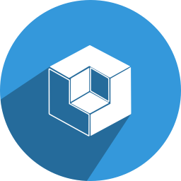
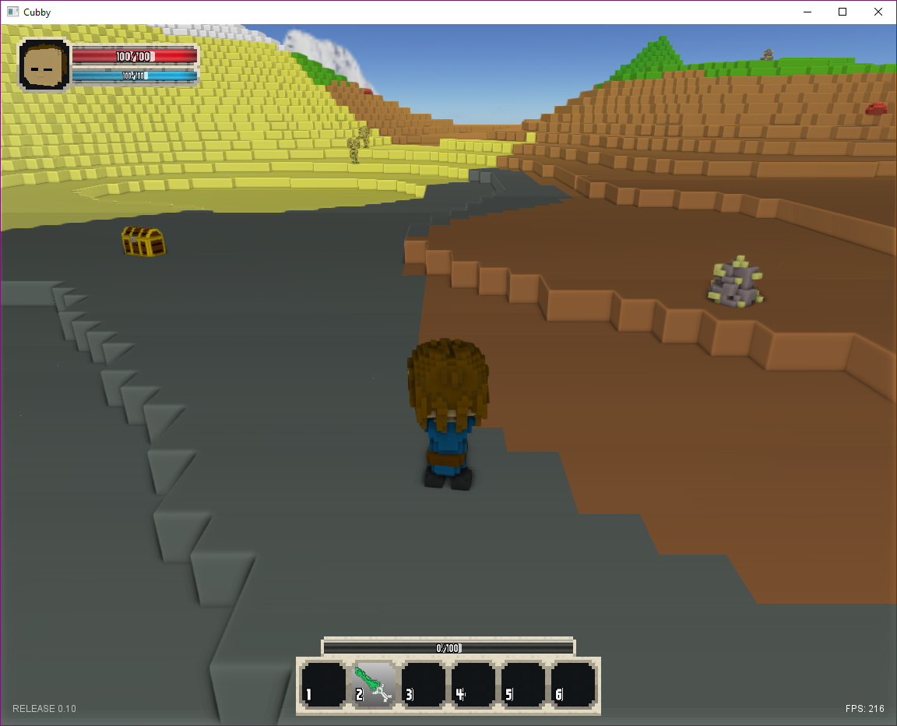
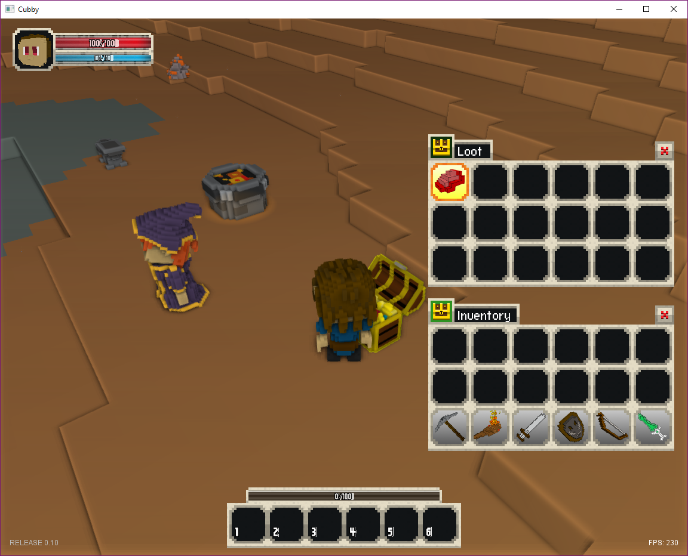

# Cubby-v1

## Notice: This project is archived to maintain an initial version of Cubby. If you want to see a project that is actively working, please visit [Cubby](https://github.com/utilForever/Cubby) project.

Cubby is an open source voxel-based game client, that is written in C++ and OpenGL and can be used to create easy and fast voxel based games and applications. The client is written to be highly functional and very efficient at allowing voxel game creation and provides a simple framework for creating 3D voxel games.

The main code of this repository is based on [AlwaysGeeky's Vox](https://github.com/AlwaysGeeky/Vox).

## Features

* 3D voxel game client with cuboid and box-based rendering aesthetic. 
* GLSL shader support.
* Support for deferred or forward rendering.
* Fully dynamic and unlimited lighting system using deferred lighting model.
* Advanced graphics shaders included - SSAO, shadow mapping, dynamic lighting, FXAA.
* Full 3D math and geometry library (vector, matrix, quaternion, plane, bezier).
* Extensive camera functionality, either 3rd person or 1st person.
* In-built GUI that can be easily hooked up to gameplay functioanlity (re-skinable).
* Qubicle Binary (.qb) voxel model loading.
* Polygon model loading via ms3d and obj files.
* Keyframe and skeleton animation support.
* Basic 'player' functionality - movement, controls, animation.
* 'Voxel character' encapsulating character behaviours - idle looking, breathing, etc.
* Facial animation support for voxel characters.
* Voxel scenery and world items.
* Block/cube particle effect system.
* Modding and scripting support via LUA.
* Gamepad and controller support.
* Voxel world and terrain generation.
* Procedural content creation.
* Audio and music playback.

## Gameplay Features

Some parts of the Cubby gameplay logic are also incorporated into this source code repo, to better facilitate code sharing and the different sub-systems that make up the game. Some of the gameplay features of Cubby are as follows:

* Player movement and controls.
* Inventory and item management.
* NPC AI and player interations.
* Quets and gameplay objectives.
* Enemies and monsters.
* Combat using melee and ranged weapons, magic and spellcasting.
* Farming and crop management.
* Character creation and player generation.
* World customization and creation elements.

## What's the difference between Cubby and Vox?

All of the Cubby source code is based on [AlwaysGeeky's Vox](https://github.com/AlwaysGeeky/Vox). To develop MMORPG, we'll improvement and differentiate Cubby game client.

* Apply Modern C++ (C++11/14/17) features
* (To-do) Multi-play support.
* (To-do) DirectX 11/12 and Vulkan support.
* (To-do) World map generator support.
* (To-do) Resource simulator support.
* (To-do) Monster controller support.
* and so on...

## How to Build

To learn how to build, test, and install the SDK, please check out [INSTALL.md](https://github.com/utilForever/Cubby/blob/main/INSTALL.md).

## Screenshots

## How To Contribute

Contributions are always welcome, either reporting issues/bugs or forking the repository and then issuing pull requests when you have completed some additional coding that you feel will be beneficial to the main project. If you are interested in contributing in a more dedicated capacity, then please contact me.

## Contact

You can contact me via e-mail (utilForever at gmail.com). I am always happy to answer questions or help with any issues you might have, and please be sure to share any additional work or your creations with me, I love seeing what other people are making.

## License

The class is licensed under the [GNU General Public License](https://opensource.org/licenses/GPL-3.0):

Copyright &copy; 2017 [Chris Ohk](http://www.github.com/utilForever).

The GNU General Public License is a free, copyleft license for software and other kinds of works.

The licenses for most software and other practical works are designed to take away your freedom to share and change the works. By contrast, the GNU General Public License is intended to guarantee your freedom to share and change all versions of a program--to make sure it remains free software for all its users. We, the Free Software Foundation, use the GNU General Public License for most of our software; it applies also to any other work released this way by its authors. You can apply it to your programs, too.

When we speak of free software, we are referring to freedom, not price. Our General Public Licenses are designed to make sure that you have the freedom to distribute copies of free software (and charge for them if you wish), that you receive source code or can get it if you want it, that you can change the software or use pieces of it in new free programs, and that you know you can do these things.

To protect your rights, we need to prevent others from denying you these rights or asking you to surrender the rights. Therefore, you have certain responsibilities if you distribute copies of the software, or if you modify it: responsibilities to respect the freedom of others.

For example, if you distribute copies of such a program, whether gratis or for a fee, you must pass on to the recipients the same freedoms that you received. You must make sure that they, too, receive or can get the source code. And you must show them these terms so they know their rights.

Developers that use the GNU GPL protect your rights with two steps: (1) assert copyright on the software, and (2) offer you this License giving you legal permission to copy, distribute and/or modify it.

For the developers' and authors' protection, the GPL clearly explains that there is no warranty for this free software. For both users' and authors' sake, the GPL requires that modified versions be marked as changed, so that their problems will not be attributed erroneously to authors of previous versions.

Some devices are designed to deny users access to install or run modified versions of the software inside them, although the manufacturer can do so. This is fundamentally incompatible with the aim of protecting users' freedom to change the software. The systematic pattern of such abuse occurs in the area of products for individuals to use, which is precisely where it is most unacceptable. Therefore, we have designed this version of the GPL to prohibit the practice for those products. If such problems arise substantially in other domains, we stand ready to extend this provision to those domains in future versions of the GPL, as needed to protect the freedom of users.

Finally, every program is threatened constantly by software patents. States should not allow patents to restrict development and use of software on general-purpose computers, but in those that do, we wish to avoid the special danger that patents applied to a free program could make it effectively proprietary. To prevent this, the GPL assures that patents cannot be used to render the program non-free.